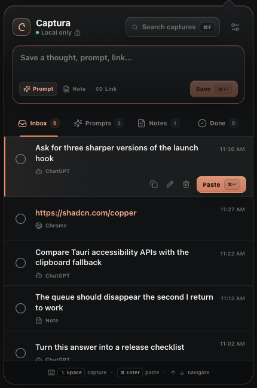

# Captura

A fast, local-first macOS menubar app for capturing things you want to keep — prompts, notes, and links — and pasting them back wherever you work.



## Features

- **Global capture** — press `⌥ Space` (configurable) in any app to save the selected text, with clipboard fallback.
- **Paste back** — send any capture straight into the app you were just working in, clipboard preserved.
- **Queue, not a junk drawer** — inbox/prompts/notes/done filters, sections, search, multi-select (`⌘`/`⇧`), merge, copy as list.
- **Markdown** — safe GFM rendering with an element/protocol allowlist.
- **Fully editable shortcuts** — every shortcut in the app can be rebound in Settings.
- **Overlay everywhere** — the panel joins fullscreen Spaces and floats above whatever you're doing.
- **Local only** — a single SQLite database on your Mac. No account, analytics, server, or sync.

## Install

Download the latest DMG from [Releases](https://github.com/blackridder22/Captura/releases), open it, and drag Captura to Applications.

On first capture/paste, macOS will ask for **Accessibility** permission (System Settings → Privacy & Security → Accessibility). Captura needs it only to read the selection and send `⌘C`/`⌘V` on your behalf.

## Build from source

Requirements: Rust (stable), Node 20+, pnpm, Xcode command line tools.

```bash
pnpm install
pnpm tauri build --bundles app,dmg
```

For a local dev loop:

```bash
./script/build_and_run.sh          # build release .app and launch it
./script/build_and_run.sh logs     # …with live logs
```

Note: sign with a stable identity (see `bundle.macOS.signingIdentity` in `src-tauri/tauri.conf.json`). Ad-hoc signing (`"-"`) makes macOS revoke Accessibility permission on every rebuild.

## Stack

- [Tauri v2](https://v2.tauri.app) — menubar-only shell (`ActivationPolicy::Accessory`), tray, global shortcuts
- Rust — SQLite persistence, AppKit overlay-window bridge, Accessibility/CGEvent capture & paste
- React + TypeScript + Vite — the panel UI

## License

MIT
